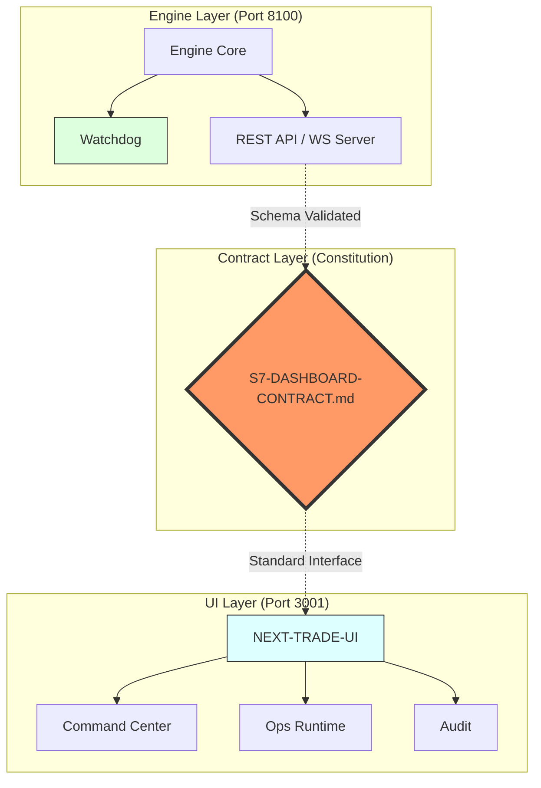

# NEXT-TRADE Architecture Diagram (Investor Demo)

아래 구조는 Dashboard Constitution 기반의 엔진-UI 분리(Contract-first)를 시각화한 공식 다이어그램입니다.

## Demo Talking Points

- 엔진 변경은 Contract 레이어에서 흡수되고 UI는 3개 공개 인터페이스만 소비합니다.
- Watchdog + Runtime Health/Event API로 운영 안정성을 계층적으로 증명합니다.
- UI는 `/command-center`, `/ops/runtime`, `/audit` 3페이지 고정 정책을 유지합니다.
